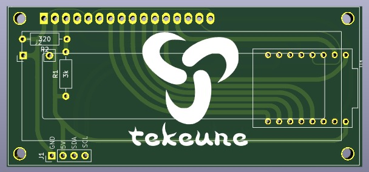

# GraphyteDisplay

Turn a cheap **16×2 HD44780 character LCD** into an **80×16 pixel graphics display**, driven by an **ESP32-C3 Super Mini**.



A **ready-to-manufacture PCB** exists for this project (`hardware/pcb.png`). It is a 2-layer board you can send straight to a fab (JLCPCB, PCBWay, and similar). Assemble the LCD and passives on that board instead of fly-wiring a protoboard.

The controller only has eight custom-character slots (CGRAM). Firmware treats the screen as a 16×2 grid of 5×8 tiles (exactly 80×16 pixels), then multiplexes four CGRAM banks every refresh. Persistence of vision makes the full bitmap look stable.

This repo contains the production board, `Graphyte.zip` (Arduino library), hardware pinout, Arduino sketches, and Python tools for drawing, clocks, and tiny black-and-white video.

---

## What you can run

| Sketch / tool | What it does |
|---|---|
| `esp_watch/` | Analog-style 3D wireframe cube + `HH:MM` clock. Time sync over USB serial, last time saved in NVS flash. |
| `telegrama_video/` | Plays a packed 80×16 video from a `.h` header (example: 502 frames @ 24 fps). |
| `graphyte_i2c_slave/` | I2C graphics slave at address `0x08`. Another MCU draws lines, rects, circles, and 5×8 text. |
| `graphyte_i2c_master_test/` | Test master that walks through every slave opcode (raw Wire). |
| `Graphyte.zip` | Arduino library for a second MCU: `drawLine`, `drawRect`, `drawCircle`, `drawText` over I2C. Examples: **GraphyteTest**, **GraphyteCube**. |
| `simulator.py` | GRAPHYTE-Designer: 80×16 pixel canvas, export draw commands. |
| `vidbw_studio.py` | Downscale a video to 80×16 B/W and export MP4, GIF, or an Arduino `.h` header. |
| `rotoscope_studio.py` | Frame-by-frame paint / onion-skin editor for the same tiny B/W format. |

---

## Ready-to-manufacture PCB

The board in `hardware/` is fab-ready. It is a 16×2 LCD backpack with the **tekeune** mark, four mounting holes, and an I2C host header so you do not have to fly-wire the display.

**On the board (top view, LCD header at the top):**

| Ref | What it is |
|---|---|
| 16-pin header (top) | HD44780 LCD. Pin 1 is the **square pad** on the left |
| **J1** | Host I2C: `GND`, `5V`, `SDA`, `SCL` (left → right) |
| **J2** | 2-pin pad next to R2 (backlight / jumper) |
| **R1** | `3k` (silkscreen) |
| **R2** | `320` Ω (silkscreen, backlight current limit) |
| 16-pin footprint (right) | Driver / module footprint (two rows of 8) |

Order it as a standard 2-layer 1.6 mm FR-4 board. After it arrives:

1. Solder R1 and R2 first.
2. Solder the 16-pin LCD header (or solder the LCD straight to the board). Pin 1 matches the square pad.
3. Fit J1 if you want the I2C slave interface (`graphyte_i2c_slave`, address `0x08`).
4. Fit the ESP32-C3 Super Mini / driver footprint on the right.
5. Flash firmware over USB **with USB CDC On Boot enabled** (see below).

If you do not have boards yet, the hand-wired pinout in the next section is the same electrical design.

## Parts

- GraphyteDisplay PCB (production board above), **or** protoboard + jumper wires
- **ESP32-C3 Super Mini** (native USB, ~4 MB flash)
- **16×2 HD44780-compatible LCD** (standard 16-pin header, 5×8 font)
- **R1 3 kΩ** and **R2 320 Ω** (already marked on the PCB)
- **10 kΩ potentiometer** for contrast only if you are wiring by hand (LCD pin 3 / V0)
- USB-C cable for power and flashing
- Optional for I2C mode: a second ESP32 as master, plus **4.7 kΩ pull-ups** on SDA and SCL to 3.3 V if the PCB does not already provide them

The Super Mini 5 V pin (USB VBUS) powers the LCD. Logic is 3.3 V; HD44780 inputs usually accept that.

---

## How it works (short)

A 16×2 character cell is 5×8 pixels. Sixteen columns × two rows = **80×16**.

Firmware keeps an 80×16 framebuffer, packs it into 32 tiles of 5×8, then on every loop:

1. Load 8 glyphs into CGRAM
2. Print those glyphs (with a space between each) on one half of a row
3. Repeat for the other three banks

That is why `loop()` must never block for long. If refresh stalls, the picture flickers or only one quadrant is visible.

LCD init is 8-bit HD44780: `0x38`, `0x0C`, `0x01`, `0x06`. **RW is not driven** — tie it to GND so the panel stays in write mode.

---

## Assemble the device (hand-wired)

Prefer the production PCB if you have it. This section is the equivalent hookup on a breadboard or protoboard.

Flash firmware **before** you solder the data bus if you can. GPIO 0 is also a boot-strap pin; a live LCD on D0 can make later uploads harder.

### 1. LCD contrast and write-only

| LCD pin | Name | Connect to |
|---|---|---|
| 1 | VSS | GND |
| 2 | VDD | **5 V** on the Super Mini |
| 3 | V0 | Wiper of a 10 kΩ pot (other ends to 5 V and GND) |
| 5 | R/W | **GND** (write only) |

Turn the pot until blocks appear, then until the background is just dark.

### 2. Control and data bus

All sketches use the same mapping. GPIO 0–7 are contiguous so one register write clocks a whole byte onto D0–D7.

| LCD pin | Name | ESP32-C3 GPIO |
|---|---|---|
| 4 | RS | **10** |
| 6 | E | **9** |
| 7 | D0 | **0** |
| 8 | D1 | **1** |
| 9 | D2 | **2** |
| 10 | D3 | **3** |
| 11 | D4 | **4** |
| 12 | D5 | **5** |
| 13 | D6 | **6** |
| 14 | D7 | **7** |
| 15 | A (backlight +) | **8** (or 3.3 V / 5 V through a resistor) |
| 16 | K (backlight −) | GND |

GPIO 8 is driven **HIGH** in `lcdInit()`. If the backlight is too bright or you do not want a GPIO pin on the LED, wire A to 5 V (or 3.3 V) through **320 Ω** and leave GPIO 8 unused.

### 3. Power

1. USB-C into the Super Mini (this is 5 V and the programming port).
2. Super Mini **GND** to LCD pin 1 and backlight K.
3. Super Mini **5 V** to LCD pin 2.
4. Super Mini **3.3 V** only if you add I2C pull-ups.

Do not feed 5 V into ESP32 GPIO pins.

### 4. Optional I2C (slave sketch only)

Used by `graphyte_i2c_slave` / `graphyte_i2c_master_test`.

| Signal | GPIO | Notes |
|---|---|---|
| SDA | **21** | 4.7 kΩ to 3.3 V |
| SCL | **20** | 4.7 kΩ to 3.3 V |
| GND | GND | Must be common with the master |

Address `0x08`, 100 kHz.

**USB CDC On Boot must stay Enabled.** On the C3, GPIO 20/21 are UART0 TX/RX when CDC is off. Serial and I2C then sit on the same wires and the slave will not ACK.

### 5. First power-on checks

1. USB connected, backlight on.
2. Contrast pot: faint boxes, then a readable field.
3. After a sketch is loaded, you should see graphics, not a single row of custom-char garbage. Garbage that never changes usually means RS/E swapped or D0–D7 not 1:1.
4. If the image “shimmers” in four stripes, refresh is running; that is expected at the pixel level.

---

## Load firmware (Arduino IDE, USB CDC **On**)

### Install the core

1. Arduino IDE 2.x.
2. **File → Preferences → Additional boards manager URLs**, add:

   `https://raw.githubusercontent.com/espressif/arduino-esp32/gh-pages/package_esp32_index.json`

3. **Boards Manager** → install **esp32** by Espressif (2.0.x or 3.x both work; the I2C slave uses `REG_WRITE` so it stays compatible).

### Board settings (required)

**Tools** menu, with the Super Mini plugged in:

| Setting | Value |
|---|---|
| **Board** | `ESP32C3 Dev Module` |
| **USB CDC On Boot** | **Enabled** |
| USB DFU On Boot | Disabled |
| USB Serial/JTAG | Enabled (if the menu shows it) |
| CPU Frequency | 160 MHz |
| Flash Size | 4MB (32Mb) |
| Partition Scheme | Default 4MB with spiffs (use **Huge APP** if a video header is huge) |
| Upload Speed | 921600 |
| Port | the ESP32-C3 COM / tty port |

**USB CDC On Boot = Enabled** is not optional for this project:

- Serial for `esp_watch` / `sync_time.py` goes over the same USB cable.
- GPIO 20 and 21 stay free for I2C.
- The IDE serial monitor matches the port you just uploaded to.

If you previously flashed with CDC **Disabled**, Windows/macOS may show a different port after you switch to Enabled. Unplug, wait a second, plug back in, pick the new port.

### Put the board in download mode (if upload fails)

Many Super Minis reset into the ROM USB bootloader by themselves. If upload hangs on “Connecting…”:

1. Unplug the LCD data bus if GPIO 0 is held in a bad state.
2. Hold **BOOT**.
3. Tap **RST**, keep holding BOOT.
4. Click **Upload**.
5. When it says “Connecting…”, release **BOOT**.

### Upload a sketch (display firmware)

Arduino needs the `.ino` filename to match the folder name.

**Clock (good first test)**

1. Open `esp_watch/esp_watch.ino`.
2. Confirm `telegrama.h` is in the same folder (10×16 font).
3. Upload.
4. You should see `HH:MM` on the left and a rotating cube on the right.
5. Time starts at `00:00` until you sync (or whatever was last stored in NVS).

**Video**

1. Copy `esp_watch/telegrama.h` into `telegrama_video/` if it is not already there (`telegrama_video.ino` includes it).
2. Open `telegrama_video/telegrama_video.ino`.
3. Keep `pioneerevladi_80x16bw.h` next to the sketch, or replace it with a header from VidBW Studio.
4. Upload. Playback uses `VIDEO_FPS` from the header (example clip is 24 fps, 502 frames, row-packed 160 bytes/frame).

**I2C slave (required before the Graphyte library examples)**

1. Open `graphyte_i2c_slave/graphyte_i2c_slave.ino` (`font5x8.h` must sit beside it).
2. Upload to the **display** board.
3. Leave USB CDC On Boot **Enabled**.

---

## Install the Graphyte Arduino library

`Graphyte.zip` is the Arduino library. It is a thin I2C master: `#include <Graphyte.h>` then call `drawLine`, `drawRect`, `drawCircle`, `drawText`, and so on. The display board must already be running `graphyte_i2c_slave`.

### Add the ZIP in Arduino IDE

1. Open Arduino IDE 2.x.
2. **Sketch → Include Library → Add .ZIP Library…**
3. Select `Graphyte.zip` from this repo (the file at the project root).
4. Wait for “Library added to your libraries.” The IDE unpacks it into your sketchbook `libraries/Graphyte` folder.

To confirm it installed: **Sketch → Include Library** should list **Graphyte**, and **File → Examples → Graphyte** should show **GraphyteTest** and **GraphyteCube**.

If the examples menu is empty, close and reopen the IDE. Do not unzip the file by hand into a nested `Graphyte/Graphyte` folder — **Add .ZIP Library** is the reliable path.

### Use it in your own sketch

```cpp
#include <Graphyte.h>

GraphyteDisplay gfx; // default I2C address 0x08

void setup() {
  Serial.begin(115200);
  gfx.begin(21, 20, 100000); // SDA, SCL, 100 kHz (ESP32-C3 Super Mini)
  gfx.clear();
  gfx.drawText(2, 4, "HELLO");
}

void loop() {}
```

On boards with fixed I2C pins you can call `gfx.begin()` with no arguments. Default slave address is `0x08` (`GRAPHYTE_DEFAULT_ADDR`).

---

## Upload the example sketches

These examples run on a **second** board (the I2C master). The GraphyteDisplay PCB / Super Mini is the slave.

Wire the master to **J1** on the PCB (`GND`, `5V` if the master should power the display, `SDA`, `SCL`). Share ground. The examples use GPIO **21 = SDA** and GPIO **20 = SCL** at 100 kHz — the same pins as the Super Mini.

Use the same **Tools** settings as firmware upload:

| Setting | Value |
|---|---|
| **Board** | `ESP32C3 Dev Module` |
| **USB CDC On Boot** | **Enabled** |
| Port | the **master** board’s COM port |

### GraphyteTest

Walks through every opcode: clear, lines, rects, circles, invert variants, then `HELLO I2C`.

1. **File → Examples → Graphyte → GraphyteTest**
2. Select the master board’s port.
3. **Sketch → Upload** (Ctrl+U).
4. **Tools → Serial Monitor**, 115200 baud, newline.
5. You should see `Slave found, starting test loop.` then `… -> OK` for each command. The display cycles the same shapes as the built-in `graphyte_i2c_master_test` sketch.

If you get `NACK on address`, the slave is not running, J1 is unplugged, or CDC is off on the slave (UART0 stole GPIO 20/21).

### GraphyteCube

A spinning wireframe cube. The master only sends `clear` + twelve `drawLine` calls per frame; the slave does the pixels.

1. **File → Examples → Graphyte → GraphyteCube**
2. Upload to the master board.
3. You should see a cube rotating on the 80×16 LCD at about 25 fps.

You can also open the sources directly from `Graphyte/examples/GraphyteTest` and `Graphyte/examples/GraphyteCube` in this repo after installing the ZIP.

---

## Clock time sync

The C3 has no battery RTC. `esp_watch` counts seconds since midnight with `millis()`, and stores the last value in NVS. While the board is unpowered, time does not advance.

```text
SETTIME HH:MM
SETTIME HH:MM:SS
```

or a bare `HH:MM` / `HH:MM:SS` in the Serial Monitor (**115200**, newline). Reply is `OK HH:MM:SS`.

From a PC:

```bash
pip install pyserial
python esp_watch/sync_time.py            # auto-detect port
python esp_watch/sync_time.py COM5
python esp_watch/sync_time.py --watch    # re-sync every hour
```

---

## I2C graphics protocol

One I2C write = one command. Coordinates are `uint8_t`; pixels outside 0–79 / 0–15 are clipped. The framebuffer is additive until `OP_CLEAR`.

| Opcode | Name | Payload |
|---|---|---|
| `0x00` | CLEAR | none |
| `0x01` | DRAW_LINE | `x0, y0, x1, y1` |
| `0x02` | INVERT_LINE | `x0, y0, x1, y1` |
| `0x03` | DRAW_RECT | `x, y, w, h` |
| `0x04` | INVERT_RECT | `x, y, w, h` |
| `0x05` | DRAW_RECT_FILLED | `x, y, w, h` |
| `0x06` | INVERT_RECT_FILLED | `x, y, w, h` |
| `0x07` | DRAW_CIRCLE | `xc, yc, r` |
| `0x08` | INVERT_CIRCLE | `xc, yc, r` |
| `0x09` | DRAW_CIRCLE_FILLED | `xc, yc, r` |
| `0x0A` | INVERT_CIRCLE_FILLED | `xc, yc, r` |
| `0x0B` | DRAW_TEXT | `x, y` + ASCII (max 16 chars, 5×8, codes 32–126) |

The receive callback only queues bytes. Pixel work runs in `loop()` so a filled circle does not stall the bus.

These primitives match `simulator.py` (`graphyte.draw_line`, `draw_rect`, `draw_circle`, …) so a designer export and a live I2C stream produce the same pixels.

---

## Python tools

```bash
pip install opencv-python pillow numpy pyserial
```

Tkinter is included with most desktop Python builds.

### GRAPHYTE-Designer (`simulator.py`)

```bash
python simulator.py
```

80×16 canvas. Tools: line, rect, filled rect, circle, filled circle, each with invert. Load a 5×8 `.txt` font, place text, undo/redo, export a command list (`graphyte.draw_line(...)`, etc.).

### VidBW Studio (`vidbw_studio.py`)

```bash
python vidbw_studio.py
python vidbw_studio.py clip.mp4 --gui
python vidbw_studio.py clip.mp4 -o frames.h --format h --pack row -w 80 -H 16
```

Preview the 80×16 conversion, then export MP4, GIF, or a PROGMEM header. For this LCD use **80×16** and **row** packing. Drop the `.h` into `telegrama_video/` and `#include` it (see `pioneerevladi_80x16bw.h` for the expected `VIDEO_*` macros and `video_get_frame()`).

### Rotoscope Studio (`rotoscope_studio.py`)

```bash
python rotoscope_studio.py
python rotoscope_studio.py clip.mp4
python rotoscope_studio.py --project edit.json
```

Auto-convert, then paint frames with onion skin. Export PNG sequence, GIF, MP4, or a C header.

---

## Repository layout

```text
GraphyteDisplay/
├── Graphyte.zip               # Arduino library (Add .ZIP Library)
├── Graphyte/                  # same library, unpacked
│   ├── library.properties
│   ├── src/Graphyte.h
│   └── examples/
│       ├── GraphyteTest/      # File → Examples → Graphyte → GraphyteTest
│       └── GraphyteCube/      # File → Examples → Graphyte → GraphyteCube
├── LICENSE                    # GNU GPL-3.0
├── hardware/
│   └── pcb.png                # production PCB (ready to manufacture)
├── esp_watch/
│   ├── esp_watch.ino          # cube + clock
│   ├── telegrama.h            # 10×16 font (ASCII 32–126)
│   └── sync_time.py
├── telegrama_video/
│   ├── telegrama_video.ino    # video player
│   └── pioneerevladi_80x16bw.h
├── graphyte_i2c_slave/
│   ├── graphyte_i2c_slave.ino
│   └── font5x8.h              # 5×8 font for I2C text
├── graphyte_i2c_master_test/
│   └── graphyte_i2c_master_test.ino
├── simulator.py
├── vidbw_studio.py
└── rotoscope_studio.py
```

---

## Troubleshooting

| Symptom | Likely cause |
|---|---|
| Upload stuck on Connecting | Hold BOOT, tap RST; disconnect GPIO 0 from the LCD |
| Port disappears after flash | **USB CDC On Boot** mismatch; set **Enabled**, replug |
| Serial Monitor empty / I2C NACK on 20/21 | CDC is **Disabled** — UART0 stole those pins |
| Backlight on, no pixels | Contrast pot; 5 V to LCD VDD; R/W to GND |
| Random blocks, no graphics | RS/E swapped, or D0–D7 not mapped 1:1 to GPIO 0–7 |
| Only one stripe of the image | `loop()` blocked; keep the CGRAM refresh running |
| Clock stuck at 00:00 | Never synced; run `sync_time.py` (needs CDC **On**) |
| Video sketch will not compile | Missing `telegrama.h` in `telegrama_video/` |
| Master: `NACK on address` | Slave not running, J1 unplugged, no common GND, or CDC **Disabled** on the slave |
| Examples menu has no Graphyte | ZIP not installed; **Sketch → Include Library → Add .ZIP Library…** and pick `Graphyte.zip` |

---

## License

This project is licensed under the **GNU General Public License v3.0**. See [LICENSE](LICENSE) for the full text.

You may copy, modify, and share the firmware, the Graphyte Arduino library, and the Python tools under GPL-3.0. There is no warranty.
